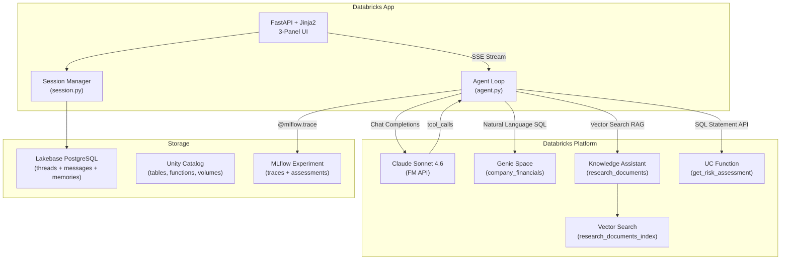
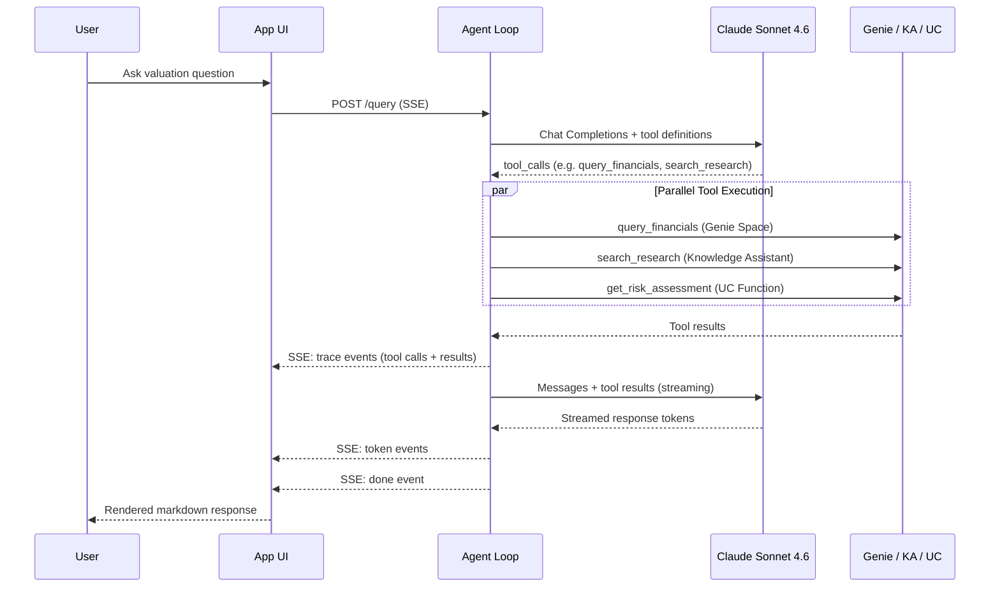
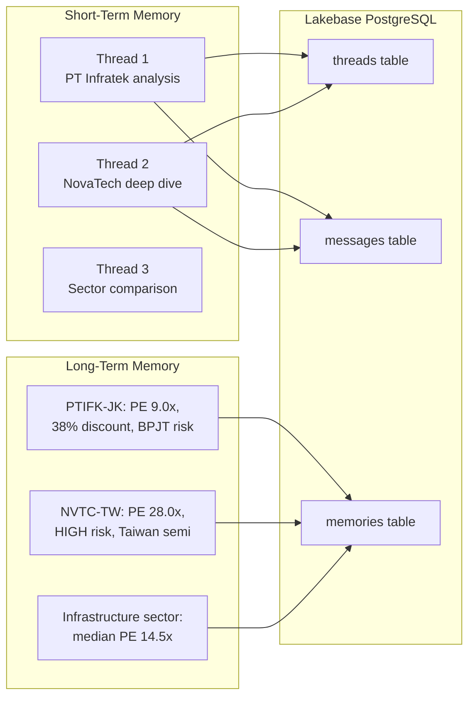
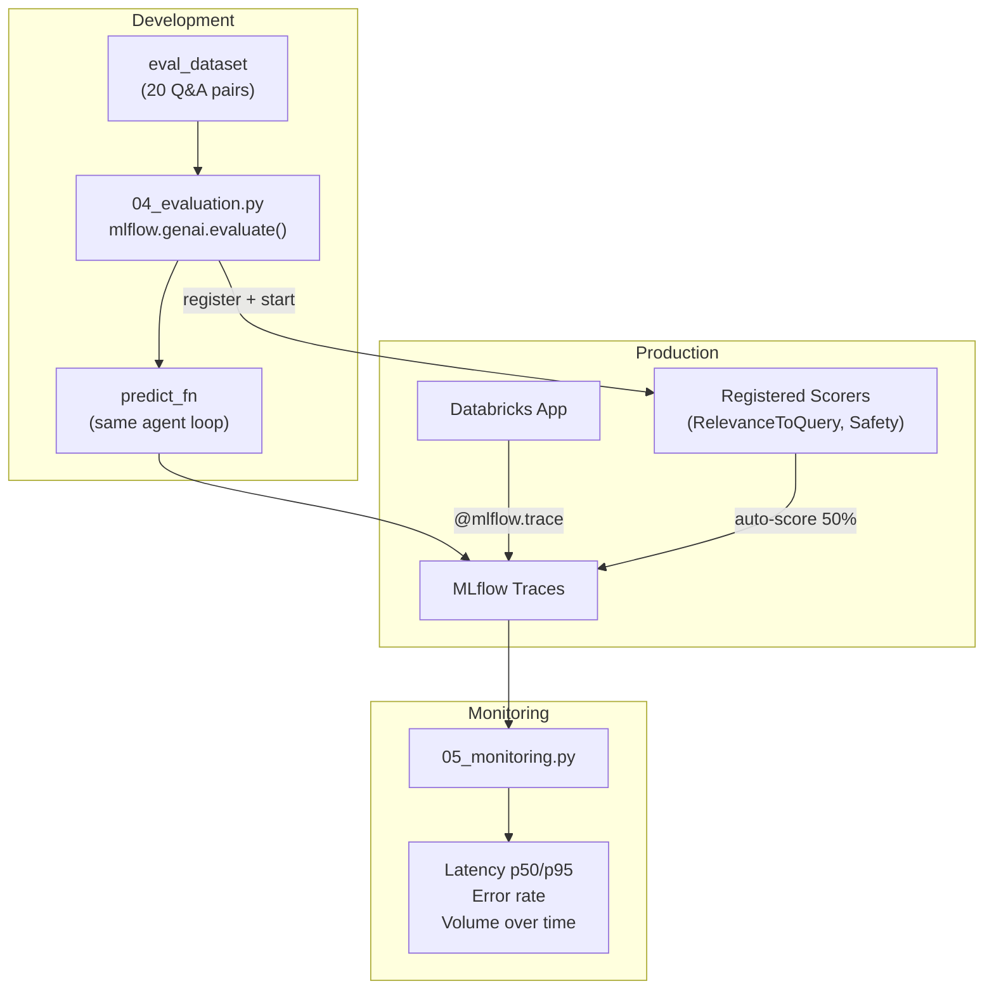

# Valuation Intelligence Agent

AI-powered valuation analysis for institutional fund managers, built on the Databricks platform.

A fund manager asks a natural-language valuation question. The agent retrieves financial data via Genie Space, searches research documents via Knowledge Assistant, assesses risk via UC functions, and synthesizes a valuation brief with cited sources — all streamed in real-time.

## Architecture



## Agent Loop



## Memory Architecture



**Short-term**: Full conversation per thread_id. Survives app restarts. Enables multi-turn follow-ups.

**Long-term**: Key insights extracted by LLM after each response. Injected into system prompt for future sessions. Personalizes across conversations.

## Evaluation and Monitoring



**Same scorers in dev and prod**: `RelevanceToQuery()` and `Safety()` are used in offline evaluation and registered for continuous production monitoring at 50% sampling.

## Tools

| Tool | Backend | Purpose |
|------|---------|---------|
| `query_financials` | Genie Space | Natural language SQL over `company_financials` table |
| `search_research` | Knowledge Assistant | Vector search over `research_documents` (RAG) |
| `get_risk_assessment` | UC Function (SQL) | PE divergence vs sector median, risk classification |

The LLM decides which tools to call based on the query. Follow-up questions use conversation context first — tools are only called when new data is needed.

## Project Structure

```
databricks.yml                  # DAB bundle config (serverless jobs)
app/
  app.yaml                      # Databricks App manifest + env vars
  app.py                        # FastAPI routes (/, /query SSE, /sessions, /health)
  agent.py                      # Agent loop with parallel tool execution + MLflow tracing
  session.py                    # Lakebase session history (short-term + long-term memory)
  config.py                     # Resource IDs, system prompt, presets
  requirements.txt              # Python dependencies
  templates/
    index.html                  # 3-panel UI (sessions | chat | trace)
  static/
    style.css                   # Dark navy theme
    app.js                      # SSE streaming, markdown rendering, session management
src/
  01_setup_uc_functions.py      # Create UC functions + grant permissions
  02_setup_vector_search.py     # Create/verify Vector Search index
  03_setup_lakebase.py          # Provision Lakebase instance
  04_evaluation.py              # MLflow evaluate with LLM-as-a-Judge
  05_monitoring.py              # Trace metrics dashboard
```

## Setup

### Prerequisites

- Databricks workspace with serverless compute
- Databricks CLI v0.285+ (`databricks --version`)
- CLI profile configured (`databricks auth login --profile YOUR_PROFILE`)

### Deploy

```bash
# 1. Deploy DAB bundle (jobs + sync files)
databricks bundle deploy --profile YOUR_PROFILE

# 2. Run setup pipeline (UC functions, VS index, Lakebase)
databricks bundle run setup_pipeline --profile YOUR_PROFILE

# 3. Deploy the app
databricks apps deploy vi-agent-app \
  --source-code-path /Workspace/Users/<user>/.bundle/valuation_intelligence/default/files/app \
  --profile YOUR_PROFILE
```

### Run Evaluation

```bash
databricks bundle run evaluation --profile YOUR_PROFILE
```

### Run Monitoring

```bash
databricks bundle run monitoring --profile YOUR_PROFILE
```

## Key Configuration

| Resource | Value |
|----------|-------|
| App URL | `YOUR_APP_URL` |
| LLM | `databricks-claude-sonnet-4-6` |
| Knowledge Assistant | `YOUR_KA_ENDPOINT` |
| Genie Space | `YOUR_GENIE_SPACE_ID` |
| SQL Warehouse | `YOUR_SQL_WAREHOUSE_ID` |
| Lakebase | `YOUR_LAKEBASE_HOST` |
| MLflow Experiment | `/Shared/vi_demo/vi_demo` (ID: `YOUR_MLFLOW_EXPERIMENT_ID`) |
| Catalog/Schema | `YOUR_CATALOG.vi_demo` |

## Demo Flow (30 minutes)

1. **Set the Scene** (2 min) — Valuation analysis takes days. Show the app.
2. **Live Query** (5 min) — Ask about PT Infratek. Watch tools execute in parallel, response stream in.
3. **Multi-turn Follow-up** (3 min) — "What's driving the PE gap?" Agent uses session context.
4. **MLflow Tracing** (5 min) — Open experiment, walk through tool calls and reasoning chain.
5. **MLflow Evaluate** (5 min) — Show evaluation results and LLM-as-a-Judge scores.
6. **Monitoring** (3 min) — Latency metrics, error rates, scorer assessments.
7. **Unity Catalog** (2 min) — Data, functions, traces under governance.
8. **Q&A** (5 min)

## Databricks Capabilities Demonstrated

| # | Capability | How Used |
|---|-----------|----------|
| 1 | **Foundation Model API** | Claude Sonnet 4.6 via Chat Completions |
| 2 | **Genie Space** | Natural language SQL over financial data |
| 3 | **Knowledge Assistant** | Vector search RAG over research documents |
| 4 | **Vector Search** | Embedding-based retrieval (databricks-gte-large-en) |
| 5 | **Unity Catalog** | Tables, functions, volumes, governance |
| 6 | **Databricks Apps** | Production FastAPI frontend |
| 7 | **Lakebase** | PostgreSQL for conversation memory |
| 8 | **MLflow Tracing** | Agent-level observability |
| 9 | **MLflow Evaluate** | LLM-as-a-Judge quality scoring |
| 10 | **DAB** | Infrastructure-as-code deployment |
